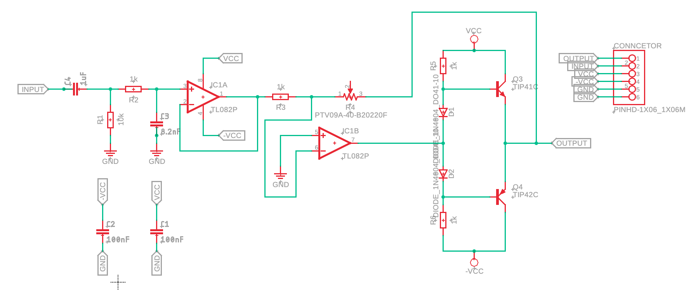

# audio-amplifier-pcb
3-stage audio amplifier PCB: bandpass filter, op-amp, Class AB power stage
## Overview
Designed a 3-stage audio amplifier PCB as part of the Microelectronics Laboratory course at Università di Padova.

**Stages:**
- Bandpass filter (16 Hz – 20 kHz)
- Inverting op-amp with adjustable gain (potentiometer-controlled)
- Class AB power amplifier (2 diodes + 2 transistors)

## Tools Used
- LTSpice (circuit simulation)
- Autodesk Fusion (schematic + PCB layout)
- Lab instruments: oscilloscope, multimeter

## Results
| Parameter | Target | Measured |
| Voltage Gain | 10x | 11x |
| Bandwidth | 16 Hz – 20 kHz | 23 Hz – 17 kHz |
(small deviations due to the usage of slightly different component values during the laboratory testing)

## Component Selection
Components selected by reviewing datasheets against load and power supply requirements.
Circuit simulation in LTSpice confirmed correct operation before fabrication.
